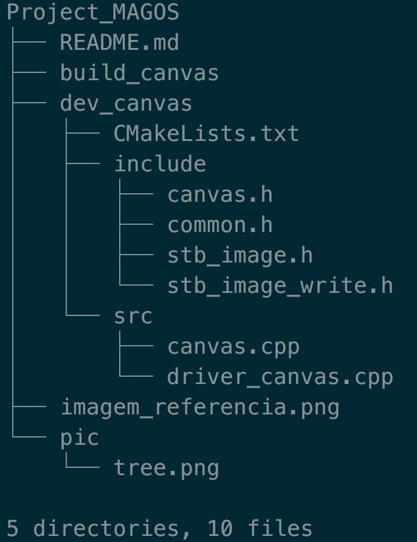

# Projeto Cantas

## Introdução

Este é um subprojeto de programação que faz parte do desenvolvimento do **Projeto MAGOS**, projeto final de LP1.

Neste projeto você deve desenvolver uma classe `Canvas` com o objetivo de suportar funções para que o cliente possa "desenhar" linhas e retângulos preenchidos sobre uma imagem.

## Responsabilidades

O **cliente** é responsável por:

1. Indicar as dimensões (horizontal e vertical) em pixels do canvas via construtor.
2. Realizar as operações de desenho, da forma que desejar.
3. Receber do objeto `Canvas` um ponteiro para `unsigned char` que deverá ser repassado para a função de gravação de imagem.
4. Realizar a gravação da imagem invocando as funções apropriadas.

O **programador** do `Canvas` é responsável por:

1. Alocar a memória para desenho (com `new` ou _smart pointer_ ) que corresponde a uma matriz de pixels, com as dimensões especificadas via construtor e com 3 canais de cores: vermelho, verde e azul.
2. Suportar funções de desenho.
3. Ser capaz de retornar para o cliente um ponteiro para a memória alocada no passo 1.

## Gravação de imagem

A gravação da imagem será feito pelo **cliente** utilizando funções da biblioteca [STB](https://github.com/nothings/stb).

## A Tarefa

Esse projeto é fornecido de maneira *incompleta*, mas compilável.
Você deve implementar os métodos da classe `Canvas` de maneira que o cliente `driver_canvas.cpp` possa ser executado.
Se o programa for executado corretamente, a imagem de saída deve ser idêntica a imagem fornecida com esse projeto.
Portanto a imagem fornecida deve funcionar como *gabarito* para uma auto-avaliação se seu projeto está correto ou não.

## Compilação

Recomenda-se a utilização do `cmake` para compilar o projeto.
As instruções, caso você ainda não tenha aprendido a usar o cmake, são as seguintes.

1. Clone o projeto ou baixe o zip. A pasta resultante deve ter a seguinte organização:

2. Implemente os métodos da classe `Canvas`, descritos em `canvas.h` e implementados em `canvas.cpp`.
3. A partir da raiz do projeto Magos, faça `mkdir build_canvas && cd build_canvas`.
4. Use o comendo do cmake para criar o Makefile: `cmake -G "Unix Makefiles" ../dev_canvas`.
5. Realize a compilação com `make`.
6. Se a compilação deu certo, execute o programa gerado com `./dcanvas`.
7. Para saber se está tudo correto, confira a imagem `teste.png` com a `imagem_referencia.png` uma pasta acima.

Para compilar o projeto novamente, em caso de alteração de código fonte, basta repetir o passo 5 em diante.

&copy; DIMAp/UFRN 2018.

